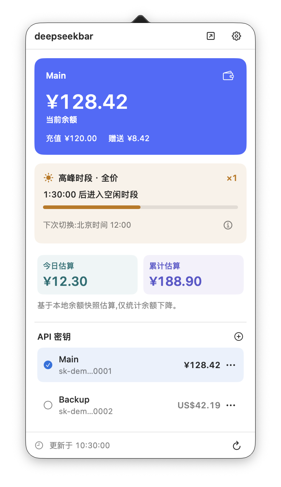

# DeepSeekBar

A lightweight macOS menu bar app for following DeepSeek usage at a glance — API balance, multi-key management, usage estimates, low-balance alerts, and the current peak / off-peak price period.

<p align="center">
  <picture>
    <source media="(prefers-color-scheme: dark)" srcset="figures/main_dark.png">
    <source media="(prefers-color-scheme: light)" srcset="figures/main.png">
    
  </picture>
</p>

## Features

- **Menu bar balance** — live total balance (with currency symbol) next to the menu bar; turns orange with a `!` marker when the balance can no longer cover API calls (`is_available = false`).
- **Peak / off-peak pricing** — DeepSeek charges half price outside weekday peak windows, and the menu bar says which side of the line you are on at a glance: `½` during off-peak, `×1` during peak, with an optional live countdown to the next switch. The popover card shows the current rate, how far through the block you are, and the next switch in Beijing time.
- **Multi-key management** — add any number of DeepSeek API keys, rename them, switch the active key with one click, and see each key's balance at a glance. Duplicate keys are rejected.
- **Balance overview** — a solid DeepSeek-blue card shows the active account's balance and its granted vs topped-up split; pricing details expand in place.
- **Usage estimates** — separate today / total figures, estimated from local balance snapshots (top-ups reset the baseline; DeepSeek's API exposes no usage endpoint).
- **Low-balance alerts** — configurable threshold with a local notification (fires once per alerting period, re-arms on recovery), plus an automatic alert when the official `is_available` flag goes false.
- **Launch at login** — standard macOS login item (SMAppService).
- **Auto updates** — daily check against GitHub releases; the popover shows a banner when a new version is available.
- **Localization** — English and 简体中文 (follows the system language).
- **Adaptive app icon** — Liquid Glass layers support light, dark, clear, and tinted appearances on macOS 26, with an ICNS fallback for earlier systems.

## Peak and off-peak pricing

DeepSeek bills off-peak tokens at half the peak rate ([official pricing page](https://api-docs.deepseek.com/quick_start/pricing)):

| Time (Beijing) | Period | Price |
| --- | --- | --- |
| Mon–Fri 09:00–12:00 and 14:00–18:00, excluding Chinese public holidays | Peak | 100% |
| Mon–Fri 12:00–14:00, every weekday 18:00–09:00, weekends, and public holidays all day | Off-peak | 50% |

- Ranges are half-open: 12:00 sharp and 18:00 sharp are already off-peak, 09:00 sharp is already peak.
- The decision is always made in `Asia/Shanghai` (UTC+8, no daylight saving), whatever your Mac's time zone is. When the two differ, the card also shows the switch in your local time.
- Public-holiday dates come from the State Council's 2026 notice ([国办发明电〔2025〕7号](https://www.gov.cn/zhengce/zhengceku/202511/content_7047091.htm)) and are bundled with the app — the pricing indicator makes no network request. For a year the app does not know yet, it falls back to weekday/weekend rules and says so on the card.
- Make-up workdays (调休上班) fall on weekends and stay off-peak all day, which is what DeepSeek's rule says.

The idea of putting this rule in the menu bar follows [DeepSeekStatus](https://github.com/owenzhao/DeepSeekStatus); DeepSeekBar's implementation, data model, and tests are its own, and its account and usage features are unchanged.

## Security

- API keys are stored in the **macOS Keychain** (service `com.deepseekbar.app`); `api_keys.json` in Application Support holds non-sensitive metadata only (id/name/creation date) with `0600` permissions.
- Older builds that stored plaintext keys are migrated to the Keychain automatically on first launch.
- The app talks only to `api.deepseek.com` (balance endpoint) and `api.github.com` (update check). Keys are never sent anywhere else.
- Peak / off-peak pricing is computed locally from the bundled holiday table; it needs no account and no network.
- As a fallback for CLI users, the `DEEPSEEK_API_KEY` environment variable (and legacy `~/.deepseek/api_key` files) are picked up when no key is saved in the app.

## Install

Download the latest DMG from [Releases](https://github.com/mengxu98/deepseekbar/releases), drag **DeepSeekBar.app** to Applications, and launch it. Release builds are universal (Apple Silicon + Intel).

> Release binaries are ad-hoc signed. On first launch, macOS Gatekeeper may ask you to approve the app (right-click → Open, or approve in System Settings → Privacy & Security).

### Build from source

```bash
git clone https://github.com/mengxu98/deepseekbar.git
cd deepseekbar
swift build                # debug build
swift test                 # unit tests
./build.sh                 # release .app + DMG in .build/release/
UNIVERSAL=1 ./build.sh     # universal (arm64 + x86_64) build
```

SwiftUI macro plugins ship with Xcode, not the Command Line Tools. If
`swift build` reports a missing `SwiftUIMacros` plugin while `xcode-select -p`
points at `/Library/Developer/CommandLineTools`, either select Xcode
(`sudo xcode-select -s /Applications/Xcode.app`) or prefix the command with
`DEVELOPER_DIR=/Applications/Xcode.app/Contents/Developer`.

Signing/notarization hooks (optional):

```bash
CODESIGN_IDENTITY="Developer ID Application: …" NOTARYTOOL_PROFILE="my-profile" ./build.sh
```

## Data locations

| Data | Location |
|---|---|
| Account metadata | `~/Library/Application Support/DeepSeekBar/api_keys.json` |
| API keys | macOS Keychain, service `com.deepseekbar.app` |
| Balance snapshots | `~/Library/Application Support/DeepSeekBar/balance_snapshots_*.json` |
| Settings (interval, alert threshold, menu-bar pricing) | `UserDefaults` (`DeepSeekBar.*`) |

## FAQ

**What decides peak vs off-peak?** DeepSeek's own rule: Beijing-time weekday peak windows are billed at full rate, everything else — including weekends and Chinese public holidays — at half rate. The card names the reason for the current day (a regular weekday, a weekend, or a named holiday). See [Peak and off-peak pricing](#peak-and-off-peak-pricing).

**Why are usage numbers estimates?** DeepSeek's API only exposes the current balance. DeepSeekBar snapshots the balance on every refresh and counts drops between snapshots; a top-up (or any significant balance rise) resets the baseline. Recent snapshots are kept raw, older ones are coalesced to hourly buckets.

**How do I delete my data?** Choose Delete from a key's more-actions menu in the popover (this also deletes the Keychain item), use "Reset usage" for snapshots, and delete `~/Library/Application Support/DeepSeekBar/` to remove everything else.

**The menu bar shows an error.** Hover the item for the message. `API key is invalid` means the key was rejected (401) — click Replace in the popover to update it.

## License

MIT
